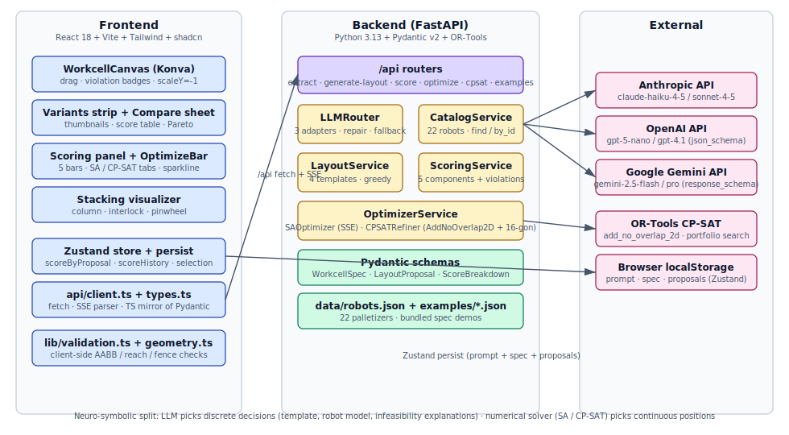

# XYZ Robotics — LLM-Driven Workcell Layout Optimizer

End-to-end pipeline: **natural language → structured spec → robot selection
→ optimized 2D layout → interactive editing → re-optimization (SA + CP-SAT)
→ 3D animated preview**.



## TL;DR

I built this around three engineering bets:

1. **Multi-LLM abstraction** — one canonical Pydantic schema, three
   provider-shaped adapters (Claude tool use / OpenAI strict
   `json_schema` / Gemini `response_schema` + JSON mime), a
   validation-repair loop, and cross-provider fallback. A `CostLedger`
   accumulates per-provider USD usage for telemetry.

2. **Hard / soft constraint discipline** — ISO 13855 separation distance,
   reach feasibility, and AABB non-overlap are inviolable; throughput,
   compactness, and aesthetics are weighted soft objectives. Any hard
   violation zeroes the aggregate score. Safety is never substitutable.

3. **CP-SAT for layout refinement** — Google OR-Tools' native
   `add_no_overlap_2d` handles disjunctive non-overlap reasoning without
   big-M tuning. The LLM picks discrete decisions (template, robot
   model); CP-SAT picks continuous positions. SA is also available for
   soft-objective exploration.

---

# Features (deep dive)

Every feature, what it does, **how it works**, and the engineering
trade-offs. Read top-to-bottom for the full pipeline; jump to a section
for a specific feature.

## 1. Natural-language → WorkcellSpec extraction

**File**: [`backend/app/services/extraction.py`](backend/app/services/extraction.py),
[`backend/app/api/extract.py`](backend/app/api/extract.py),
[`backend/app/prompts/extract_spec.md`](backend/app/prompts/extract_spec.md)

**What it does**: takes a free-form English description ("500 cph beverage
trays, 8×6m cell, EUR pallets, $160k budget…") and emits a strict
`WorkcellSpec` JSON.

**How it works**:
1. The system prompt gives an explicit output contract: SI units only,
   convert imperial inline, **set ambiguous fields to `null` AND append a
   short note to `assumptions[]`** rather than guessing.
2. Two **few-shot examples** sit in the message array — one fully-spec'd
   beverage line, one deliberately under-spec'd dry-goods line — both
   with populated `assumptions` arrays. This anchors the model on the
   "admit uncertainty" behaviour.
3. `LLMRouter.extract(...)` runs the call with `tier="fast"`
   (gemini-2.5-flash / claude-haiku / gpt-5-nano), `temperature=0`.
4. The response is parsed against the Pydantic model; on
   `ValidationError`, the **repair loop** (see §2) appends the failure
   text and retries up to twice before falling back to the next
   provider.
5. Every call is logged to `backend/logs/llm.jsonl` (prompt hash, model,
   provider, tokens in/out, USD cost, latency).

**Key principle — assumption discipline**:
The single most important hallucination-control mechanism is the
`assumptions: list[str]` field on every Pydantic model. The system
prompt forces the LLM to *write down* what it inferred or defaulted,
which (a) makes hallucinations visible to the user instead of silent,
and (b) gives the model a structured place to admit uncertainty
instead of fabricating numbers.

## 2. Multi-LLM router with validation-repair loop

**File**: [`backend/app/services/llm.py`](backend/app/services/llm.py)

**What it does**: provider-agnostic interface for structured output
across Claude / OpenAI / Gemini, with automatic schema translation,
retry on validation failure, and cross-provider fallback.

**How it works**:

### 2a. Schema adapters — the "narrow waist"
A single Pydantic model is the source of truth. Three adapter functions
translate it into each provider's structured-output schema shape:

| Provider | Function | Key transformations |
|----------|----------|---------------------|
| Claude | `for_claude(model)` | Standard JSON schema with `$defs` intact; passed as `tool.input_schema` and forced via `tool_choice={"type":"tool"}` |
| OpenAI | `for_openai_strict(model)` | `additionalProperties:false` on every object, every property listed in `required` (use `Optional[T] \| None` for nullable), strip `format`/`min`/`max`/`pattern`/`default`, inline `$defs` |
| Gemini | `for_gemini(model)` | Strip `additionalProperties` + `default` + `format`; convert tuple-style `prefixItems` → homogeneous `items` (Gemini doesn't support per-position types); convert `anyOf`-with-null → `nullable:true` flag; mixed-key `$ref` resolution (Pydantic v2 emits `{$ref, description}` together) |

**Gemini caveat**: Gemini's `Schema` Pydantic model rejects `oneOf` +
`discriminator` (Pydantic v2 emits these for our discriminated
`Component` union). Rather than mangle the schema, the Gemini path
**drops `response_schema` entirely** and instead:
- Sets `response_mime_type=application/json` (forces JSON output)
- Appends the full Pydantic schema as text to `system_instruction`
- Lets the existing repair loop (§2c) catch any drift

### 2b. Provider clients
`LLMClient` ABC with concrete `ClaudeClient` / `OpenAIClient` /
`GeminiClient`. Each implements `extract(messages, schema)` returning
an `LLMResult` with parsed Pydantic instance + tokens + cost + latency.

### 2c. Repair loop
`extract_with_repair`:
1. Call `extract`. If `parsed is not None` → done.
2. Otherwise, append two messages to the history:
   - The previous (broken) assistant output
   - A user message: *"Your previous output failed validation: {error}.
     Return ONLY valid JSON matching the schema."*
3. Retry. After `max_retries=2`, return the last attempt (caller sees
   `parsed=None` + raw text for debugging).

### 2d. Router fallback
`LLMRouter.extract(...)` walks `[default_provider, ...others]` in order,
calling `extract_with_repair` on each. The `CostLedger` records every
attempt (including failed ones) so cost telemetry is honest.

**Why hand-rolled instead of Instructor / LiteLLM**: take-home rewards
visibility — every line of the abstraction is in one ~500-line file so
an interviewer can see exactly what each provider needs.

## 3. Robot catalog + selection

**File**: [`backend/app/services/catalog.py`](backend/app/services/catalog.py),
[`backend/app/data/robots.json`](backend/app/data/robots.json)

**What it does**: filters 22 real palletizing robots
(ABB / FANUC / KUKA / Yaskawa / Kawasaki) by capability and budget.

**How it works**:
1. `robots.json` is the source of truth: 22 entries with `payload_kg`,
   `reach_mm`, `vertical_reach_mm_min/max`, `axes`, `repeatability_mm`,
   `footprint_l_mm`, `footprint_w_mm`, `weight_kg`,
   `cycles_per_hour_std` (at 400/2000/400 standard cycle), and
   `price_usd_low/high`. Specs are from manufacturer datasheets;
   prices triangulated from RobotWorx / Robots.com / Surplus Record.
2. `RobotCatalogService.find(min_payload_kg, min_reach_mm,
   max_price_usd, axes_filter, use_case_filter, min_cycles_per_hour)`
   filters and ranks **cheapest-first** within the feasible set.
3. `effective_max_reach_mm = 0.85 * reach_mm` is exposed as a property
   — palletizing best-practice derate so we never plan against the
   manufacturer's nominal envelope.

**Selection logic in `GreedyLayoutGenerator._pick_robot`**:
- Required payload = `case_mass_kg × pick_count + 30 kg EOAT`
- Required reach = coarse function of cell envelope diagonal
- Required cph = `target_uph × 1.10` (10% headroom); halved for
  dual-pallet (η_overlap≈0.95 → ~1.9× UPH lift)
- If 6-axis required (mixed sequence), filter by
  `ideal_use_case=mixed_sku`
- If nothing fits, **relax in order**: budget → reach → throughput,
  recording each relaxation as a `LayoutProposal.assumptions[]` entry

## 4. Greedy layout templates

**File**: [`backend/app/services/layout.py`](backend/app/services/layout.py),
[`backend/app/api/layout.py`](backend/app/api/layout.py)

**What it does**: produces up to 3 candidate `LayoutProposal`s using
4 different topology templates.

**How it works**:
- **`in_line`** — robot at cell centre, conveyor → robot → single pallet
  in a straight line. Minimal floor area, simplest cabling.
- **`L_shape`** — infeed enters perpendicular to outfeed pallet;
  compact corner footprint with operator access on the open side.
- **`U_shape`** — pallets flank the robot east+west, infeed from
  south, operator on the open north side. Balanced reach utilization.
- **`dual_pallet`** — same geometry as U_shape but biased first when
  continuous-operation is required. UPH multiplied by 1.9 (η_overlap=0.95).

**Placement rule (key invariant)**:
- Pallet far edge sits at `0.95 × effective_reach` from robot centre.
  This guarantees BOTH reach feasibility AND ISO 13855 fence clearance
  by construction (since fence offset = `effective_reach + S_safe`).
- `_pallet_offset_mm(eff, pallet_dim) = max(0, 0.95*eff - pallet_dim)`.

**Cycle time estimation** (`estimate_cycle_time_s`):
- Trapezoidal motion profile: `t = d/v + v/a` if `d ≥ v²/a`, else
  `2·sqrt(d/a)`.
- 4-axis defaults: `v=2.5 m/s`, `a=8 m/s²`. 6-axis: ×0.85 derate.
- Cycle = motion + 0.8s pick/place dwell. Floored at
  `3600/cph_std` (manufacturer-tuned).
- Dual-pallet: divide by `2 × 0.95` for swap-and-continue.

## 5. Scoring (the contract)

**File**: [`backend/app/services/scoring.py`](backend/app/services/scoring.py),
[`backend/app/api/score.py`](backend/app/api/score.py)

**What it does**: turns a `LayoutProposal` + `WorkcellSpec` + `RobotSpec`
into a `ScoreBreakdown` with 5 sub-scores in [0,1], an aggregate, and
a list of violations.

**Five sub-scores**:

### 5a. Compactness (`score_compactness`)
- `util = sum(component_areas) / bbox_area` — how full the layout's
  bbox is
- `envelope_use = bbox_area / cell_area` — how much of the floor is
  utilized
- `aspect_penalty = (perimeter² / area − 16) / 32` — square baseline
  is 16 (perimeter²/area = 16 for a square); long-thin shapes penalized
- Combined: `0.6·util + 0.4·envelope_use - 0.2·aspect_penalty`

### 5b. Reach margin (`score_reach_margin`)
- For each pick/place target (conveyor far end + each pallet centre),
  compute `signed_margin = effective_reach - distance(target, robot)`
- **Negative margin → HARD violation** (`unreachable`, severity=hard)
- Score = `sigmoid(min_margin, k=0.003, x0=300)` — a logistic that's
  ~0 at margin=0, ~0.5 at margin=300mm, saturates to 1 past margin~1500mm
- *Why sigmoid*: more reach margin doesn't keep getting better past a
  threshold (300mm of margin is "comfortably reachable"); linear scale
  would over-reward unnecessary slack

### 5c. Cycle efficiency (`score_cycle_efficiency`)
- Compute average robot↔target distance from the actual layout
- Trapezoidal motion: `motion_s = trapezoidal_time(2·avg_d, v, a)`
- Cycle = `motion_s + 0.8` (pick + place dwell), floored at
  `3600/cph_std`, divided by `1.9` if dual-pallet
- UPH = `3600 / cycle`
- Score = `min(uph/target_uph, 1.1) / 1.1` — saturated at 1.1× target
  (over-throughput beyond 10% gives no extra credit)

### 5d. Safety clearance (ISO 13855)
- `S_safe = K·T + C` with `K=2000 mm/s`, `T=0.3s`,
  `C=850mm` (body) or `C=600mm` (hard guard)
- For each non-conveyor body, find min distance from its bbox corners
  to any fence segment; subtract `S_safe` to get `slack`
- **Negative slack → HARD violation** (`iso13855`, severity=hard)
- Score = `sigmoid(min_slack, k=0.005, x0=500)`
- **Conveyor exempt**: real cells route the infeed through a
  light-curtain muting zone, so ISO 13855 separation only applies to
  robot + pallets, not the conveyor body

### 5e. Throughput feasibility
- Same saturated ratio as cycle efficiency but stand-alone

### Aggregator (`score_layout`)
- Default weights: `c=0.20, r=0.30, t=0.20, s=0.30`
- **Any hard violation zeroes the aggregate** (the contract)
- Throughput feasibility folded into cycle efficiency at default
  weights to avoid double-counting

**Other hard checks** (added to `violations[]`):
- `_check_overlaps` — pairwise AABB overlap (excluding fence + operator zone)
- `_check_envelope` — body extends outside cell envelope

## 6. Drag-to-edit + client-side validation

**File**: [`frontend/src/components/canvas/WorkcellCanvas.tsx`](frontend/src/components/canvas/WorkcellCanvas.tsx),
[`frontend/src/lib/validation.ts`](frontend/src/lib/validation.ts)

**What it does**: drag any component on the 2D canvas, instantly see
red strokes + violation badges; on drag end, the backend re-scores.

**How it works**:

### 6a. Konva canvas (2D)
- Two layers: **static** (cell border + 1m grid + safety fence,
  `listening=false`) and **dynamic** (robot + conveyor + pallets +
  operator zone)
- Y-flip via parent layer `scaleY={-1}` so the spec's y-up convention
  renders correctly with Konva's y-down screen coords
- `mmPerPx` auto-fits any cell envelope into the available stage size

### 6b. Snap + clamp on drag (`poseSnapAndClamp` in store)
- Snap to **50mm grid** (`snapToGrid(50)`)
- Clamp bbox inside cell envelope
- Robot snaps centre (because anchor = centre); other components snap top-left

### 6c. Client-side validation (`validateLayout` — pure function < 1ms)
Mirrors the backend's hard-violation logic so red highlights appear
**synchronously** without waiting for a network round-trip:
- AABB overlap check
- Reach feasibility (same `effective_reach` annulus)
- Fence clearance via `distToPolyline`
- Operator zone intrusion
- Outside-envelope check
- Returns a `Map<componentId, ComponentViolation[]>` so each Konva
  shape can read its own violations and render accordingly:
  - 3px red stroke
  - `OVERLAP` / `REACH` / `FENCE` / `ENVELOPE` badge above the shape
    (using `ViolationBadge` component, which uses `scaleY={-1}` so
    text reads upright on the y-flipped layer)

### 6d. Hybrid backend re-score on drag-end
- `onDragMove` → store update only (instant client validation)
- `onDragEnd` → schedule a 150ms-debounced `/api/score` POST
- Uses `AbortController` to cancel stale requests if user drags again
- New score writes to `scoreByProposal[id]` and pushes onto
  `scoreHistory` (FIFO 20) for the sparkline

## 7. Simulated annealing optimizer

**File**: [`backend/app/services/optimizer.py`](backend/app/services/optimizer.py)
(`SAOptimizer` class)

**What it does**: runs 400+ iterations of stochastic local search on
component positions, returning the best layout found.

**Algorithm**:
1. **Initialise** at the seed proposal. Compute internal score.
2. **Cool**: temperature `T(i) = T0 · (T_min/T0)^(i/n)` (geometric).
   Defaults `T0=1.0`, `T_min=0.001`, `n=400`.
3. **Perturb**: pick one random movable component (conveyor / pallet —
   robot + fence held fixed), jitter (x, y) by Gaussian
   `σ=80mm`. With **10% probability take a large jump** `σ=480mm`
   (escape deep local minima — e.g. pallet stranded in a corner).
   Conveyor has 10% chance of 90° yaw flip.
4. **Clamp** the new position inside the cell envelope.
5. **Accept** if `Δscore > 0` OR `random() < exp(Δscore / T)`.
6. **Track** the best layout seen (not just the last).
7. **Snap pass** at the end: per-component snap to 50mm grid; revert
   any snap that worsens the score.

### Internal score vs public aggregate
**The trick**: when ANY hard violation is present, the public aggregate
is 0 (the contract). But this gives SA a **flat zero landscape** — the
search has no gradient to follow and random-walks until it stumbles
into a feasible configuration.

So the SA loop uses an **internal score**:
- If `aggregate > 0`: use it directly
- Otherwise: `-Σ|margin_mm| / 10000` — a soft penalty proportional to
  total violation magnitude

This gives SA a smooth gradient even inside the infeasible region. Once
SA reaches feasibility, it switches back to maximising the real
aggregate. The user-facing history still reports the public aggregate
(so the UI sparkline is meaningful).

### `/api/optimize/stream` SSE
Long-running SA runs are streamed as **Server-Sent Events**:
- `progress` events every `max_iter/80` iterations: `{iteration,
  current_score, best_score}`
- Final `done` event with the full result
- Implementation: `asyncio.Queue` + `asyncio.to_thread` (SA is
  CPU-bound, must not block the event loop) + `loop.call_soon_threadsafe`
  to push events from the worker thread

The frontend parses the SSE stream with a fetch + ReadableStream
combo (EventSource doesn't support POST bodies).

## 8. CP-SAT refiner (engineering depth showcase)

**File**: [`backend/app/services/optimizer.py`](backend/app/services/optimizer.py)
(`CPSATRefiner` class)

**What it does**: solves layout placement as a constraint program with
guaranteed feasibility and optimal-with-respect-to-bbox compactness.

**The model**:
1. **Decision variables**: for each non-robot, non-fence body, two
   `IntVar`s for `x` and `y` (mm). Robot footprint added as a
   fixed-position obstacle.
2. **Non-overlap**: `model.add_no_overlap_2d(x_intervals, y_intervals)`
   — the killer constraint. CP-SAT's native disjunctive non-overlap
   reasoning, no big-M tuning required.
3. **Reach + fence** as a **16-half-plane polygon** inscribed in the
   disk of radius `0.85·R_max`:
   - For each angle `θ_k = 2π·k/16`, k=0..15
   - Add linear constraint:
     `cos(θ_k)·x + sin(θ_k)·y ≤ (eff - 20mm) · 1000 + cos(θ_k)·(rx - offset_x) + sin(θ_k)·(ry - offset_y)`
   - Trig coefficients scaled by 1000 to stay integer
   - 20mm slack on the rhs absorbs integer-rounding error
   - Each pick/place target gets 16 constraints; each body's 4 bbox
     corners get another 64 (fence clearance for non-conveyor bodies)
4. **Objective**: lexicographic — hard constraints encoded as model
   constraints (infeasibility = INFEASIBLE status), then minimise
   `bx + by` where `bx ≥ x_i + w_i`, `by ≥ y_i + h_i` for all bodies
   (a perimeter-corner proxy for compactness)
5. **Warm start** from the seed pose via `model.add_hint(x, seed_x)`.
6. **Solver settings**: `max_time_in_seconds=15`,
   `num_search_workers=4` (portfolio search).

**Why CP-SAT over MILP from scratch**:
- `add_no_overlap_2d` handles the disjunctive non-overlap with native
  lazy clause generation
- Modelling the same in MILP needs big-M constants whose tuning is
  fragile and instance-dependent
- CP-SAT's portfolio search is free; Gurobi requires a license

**Why 16-half-plane reach approximation**:
- CP-SAT operates on integer linear constraints; quadratic distance
  isn't supported natively
- A regular 16-gon inscribed in the disk has ~1.5% radial error
- Linear constraint count = 16 per target, all easy for the solver

**Why integer-only mm scale**:
- CP-SAT requires integer variables
- All distances scaled to mm; 3-decimal precision is plenty for
  layout positioning

**Why lexicographic objective vs weighted-sum**:
- Hard constraints (no overlap, reach, fence) belong as **constraints**
  (returning INFEASIBLE if violated) — not as soft penalties
- The remaining bbox surrogate is the only thing the solver chases —
  no need to juggle penalty weights
- Cleaner mental model than tuning `λ_overlap × penalty + λ_reach × ...`

## 9. SA / CP-SAT side-by-side comparison

**File**: [`frontend/src/components/panels/OptimizeBar.tsx`](frontend/src/components/panels/OptimizeBar.tsx)

The Scoring panel has SA and CP-SAT in tabs. Both update the active
proposal's pose. The "Compare SA vs CP-SAT" dialog shows:
- Per-algorithm `seed → after → Δ` table for all 5 sub-scores +
  aggregate
- SA telemetry: walltime, iterations, accepted moves
- CP-SAT telemetry: status (OPTIMAL / FEASIBLE), objective (bbox
  corner sum in mm), walltime, branches explored

**Typical pattern**: SA finds a higher *aggregate* (because it
optimises the actual aggregate), CP-SAT finds a tighter *bbox*
(because it only optimises bbox subject to feasibility). The
trade-off is an honest demo point.

## 10. Pareto scatter (footprint vs UPH)

**File**: [`frontend/src/components/panels/ParetoScatter.tsx`](frontend/src/components/panels/ParetoScatter.tsx)

**What it does**: shows every generated proposal as a dot at
`(footprint_m², UPH)`; non-dominated points highlighted as the
Pareto frontier.

**Algorithm** (client-side):
- A point `p` is on the frontier if no other point `q` has BOTH
  `q.footprint ≤ p.footprint` AND `q.uph ≥ p.uph` (with at least
  one strict inequality)
- Implementation: `O(n²)` nested loop, fine for n ≤ 20
- Frontier points: teal; dominated: gray; active proposal: blue ★

## 11. Variants strip + "Generate more"

**File**: [`frontend/src/components/canvas/VariantsStrip.tsx`](frontend/src/components/canvas/VariantsStrip.tsx),
[`frontend/src/components/canvas/CompareSheet.tsx`](frontend/src/components/canvas/CompareSheet.tsx)

- **Variants strip**: 200×130 px Konva mini-canvases below the main
  canvas, one per proposal. Click to switch active. Each shows a
  badge with the score (or UPH if not yet scored).
- **"Generate more"**: re-calls `/api/generate-layout` and **appends**
  to the existing strip rather than replacing — lets you collect a
  variety of templates over time.
- **Compare sheet** (shadcn `Sheet`): table of all proposals with
  every sub-score column. Click a row to make it active.

## 12. Stacking pattern visualizer

**File**: [`frontend/src/lib/stacking.ts`](frontend/src/lib/stacking.ts),
[`frontend/src/components/panels/StackingPanel.tsx`](frontend/src/components/panels/StackingPanel.tsx)

**What it does**: top-down 2D visualisation of how cases stack on a
single pallet, with three patterns to choose from.

**Patterns**:
- `column` — regular grid, single orientation. Easy to compute,
  poor stability (no inter-layer locking).
- `interlock` — alternates layer orientation (0° / 90°). Two
  interlocking layer templates returned, full stack is just the
  pair tiled. Industry-standard for case stability.
- `pinwheel` — 4-around windmill cluster. Falls back to `column` if
  `(cl + cw) > pallet dimension`.

**Metrics shown** (`buildStack(pallet, case, pattern, n_layers)`):
- Cases per layer + total cases
- Total stack height = `n_layers × case_height_mm`
- **Load efficiency** = `(layer_area / pallet_area)` — volume utilization
- **CoG offset** = centroid of all cases (uniform mass) minus pallet centre

A layer slider scrubs through layers so you can watch the interlock
pattern alternate.

## 13. 3D preview with live pick-and-place animation

**File**: [`frontend/src/components/canvas/Workcell3DCanvas.tsx`](frontend/src/components/canvas/Workcell3DCanvas.tsx),
[`frontend/src/lib/cycleAnimation.ts`](frontend/src/lib/cycleAnimation.ts)

**What it does**: a perspective view of the same `LayoutProposal` with
the robot **actually executing** a pick-and-place cycle, conveyor
rollers spinning, cases drifting toward the pick point, and pallets
filling up layer by layer.

**Architecture**: `react-three-fiber` Canvas with one `useFrame` loop
that drives all animation off a shared cycle state.

### 13a. Cycle state machine
Six phases per cycle (`Phase` enum):
1. `home` (5%) — EOAT idle above robot
2. `descend_pick` (15%) — drop down to conveyor pick point
3. `lift_after_pick` (10%) — lift back up with the case
4. `transport` (30%) — fly horizontally to active pallet
5. `descend_place` (15%) — drop down onto pallet (current top of stack)
6. `lift_after_place` (25%) — return to home; **switch to the other
   pallet** for the next cycle (round-robin dual_pallet)

Each phase's duration = fraction × `proposal.estimated_cycle_time_s`,
so the animation timing matches the actual cycle the layout would run
at in production.

EOAT position interpolates `lerp(easeInOut(u))` between the keyframes.
`carrying` flag flips on `descend_pick → lift_after_pick` and back on
`descend_place → lift_after_place`. Each successful place increments
`placedPerPallet[id]`, which drives the React re-render of stacked
cases on that pallet.

### 13b. 4-axis palletizer IK
Real palletizers (FANUC M-410, ABB IRB-460 etc.) are 4-DOF:
- **J1** base yaw (rotates whole arm to face target)
- **J2** lower-arm pitch
- **J3** upper-arm pitch
- **J4** wrist yaw (just for orientation)
- A **parallelogram linkage** mechanically keeps the EOAT vertical
  regardless of J2/J3

The IK solver (`solveArmIK`):
1. `j1 = atan2(target.z - base.z, target.x - base.x)` — rotate to face
2. Project to vertical plane through `(base, target)`
3. Standard 2-link IK in that plane:
   - `D = √((target_r)² + (target_h - hip_h)²)`
   - If `D ≥ L1+L2`: fully extended (out of reach)
   - If `D ≤ |L1-L2|`: dead zone, point straight up
   - Otherwise: law of cosines, **elbow-up branch** (palletizer
     convention — arm doesn't dip below floor)
4. Convert (q2, q3) back to 3D world points for hip → elbow → wrist

Each frame, the cylinders representing lower arm / upper arm /
parallelogram links are **positioned and rotated** between consecutive
joint points via a quaternion that aligns the +Y axis to the bone
direction.

### 13c. Conveyor with rollers + cases
- Rollers (cylinders, metallic silver) rotate on `useFrame`:
  `rotation.y += dt * 4` rad/s
- 4 belt cases per conveyor, each tracks a `u` parameter in [0, 1]
  along the belt length; on each frame, `u += beltSpeed × dt`,
  wrapping back to ~-0.15 when past 1.05
- The front-most case is **hidden** while the robot is `carrying` so
  the EOAT case isn't visually duplicated

### 13d. Pallet visual model
Real EUR pallet construction (no external mesh needed):
- 5 top deck planks running along length (with gap)
- 3 bottom deck planks
- 9 corner blocks in a 3×3 grid (using drei `RoundedBox` for that
  worn-wood look)
- Stacked cases use `RoundedBox` too with 4-tone amber palette so
  alternating interlock layers are visible from any angle

### 13e. Performance considerations
- All per-frame state in `useRef` (cycle state, EOAT position, arm
  pose, belt cases) — no React re-render at 60 fps
- Only `version` React state bumps on phase transition — re-renders
  the pallet to show the newly-placed case
- 60 fps comfortably on a 2018 MacBook Pro

### 13f. UI controls
Top-left overlay: **▶/⏸** play/pause, **↻** reset cycle, **speed
slider** (0.2× – 3.0×, default 0.6× so a 1.76 s cycle plays at ~3 s
and is easy to follow).

## 14. Bundled examples (`/api/examples`)

**File**: [`backend/app/api/examples.py`](backend/app/api/examples.py),
[`backend/app/data/examples/`](backend/app/data/examples/)

`GET /api/examples` returns three pre-built specs (with descriptions
+ pre-extracted `WorkcellSpec`):
- **Beverage trays · EUR · dual pallet** — 500 cph, 12 kg trays
- **Mixed-SKU e-commerce · GMA · 6-axis** — 700 cph, 3 SKUs random
  sequence, 22 kg max
- **Heavy bag · ISO1 · single pallet** — 600 bph cement bags, 25 kg

The **Load example…** dropdown in the InputPanel skips
`/api/extract` and goes straight to `runGenerate()`, so the demo runs
end-to-end **without an LLM key**.

## 15. State management

**File**: [`frontend/src/store/layoutStore.ts`](frontend/src/store/layoutStore.ts)

Zustand store with `persist` middleware backing localStorage:
- **Persisted**: `prompt`, `spec`, `proposals`, `activeProposalId`
  (so refresh keeps your work)
- **Not persisted**: `errors`, `isExtracting`, `isGenerating`,
  `isOptimizing`, `optimizationProgress`, `lastOptimization`,
  `lastCPSAT`, `scoreByProposal`, `scoreHistory` (transient)

Actions surface async work behind sync wrappers — UI just calls
`runExtract()` / `runGenerate()` / `runOptimizeSA()` /
`runOptimizeCPSAT()` / `loadExample()` / `cancelOptimize()` and the
store handles fetch, cancellation, error capture, and state writes.

Every `updateComponentPose` call applies `poseSnapAndClamp`
(snap-to-50mm + clamp to envelope) before storing, so the canvas
never holds an out-of-bounds or off-grid pose.

---

# Setup

```bash
# Backend
cd backend
python3.13 -m venv .venv && source .venv/bin/activate
pip install -e .[dev]
cp .env.example .env  # add at least one of ANTHROPIC_API_KEY / OPENAI_API_KEY / GOOGLE_API_KEY

# Frontend
cd ../frontend
pnpm install

# Run both
cd ..
bash scripts/dev.sh
# → http://localhost:5173
```

Without an LLM key:
- Click **Load example…** in the left panel — the bundled JSON
  examples ship with a pre-extracted `WorkcellSpec`, so the demo
  skips `/api/extract` and runs everything else.

## Pipeline summary

1. **Extract** — `/api/extract` runs the LLM with two few-shot examples;
   ambiguous fields → `null` + populated `assumptions[]`
2. **Select** — `RobotCatalogService` filters 22 real palletizers,
   relaxes constraints in order if needed
3. **Layout** — Four-template greedy generator
4. **Score** — Five sub-scores, hard/soft discipline
5. **Refine** — SA (continuous, soft-objective gradient descent) or
   CP-SAT (combinatorial, lexicographic objective)
6. **Edit** — drag any component, instant client validation, debounced
   backend re-score
7. **Visualise** — 2D Konva canvas + 3D animated preview with live
   pick-and-place cycle

## Schema (excerpt)

```python
class WorkcellSpec(BaseModel):
    schema_version: Literal["1.0"] = "1.0"
    cell_envelope_mm: tuple[float, float]
    components: list[Component]      # discriminated union: Robot|Conveyor|Pallet|Fence|OperatorZone
    constraints: list[Constraint] = []
    throughput: Throughput
    case_dims_mm: tuple[float, float, float] | None = None
    case_mass_kg: float | None = None
    pallet_standard: Literal["EUR", "GMA", "ISO1", "half"] | None = None
    max_stack_height_mm: float | None = None
    budget_usd: float | None = None
    assumptions: list[str] = []      # LLM MUST populate when ambiguous
    notes: str = ""
```

## Testing

```bash
cd backend && .venv/bin/python -m pytest tests/   # 31 passed
cd frontend && pnpm exec tsc -b                    # 0 type errors
cd frontend && pnpm build                          # production bundle
```

## Project structure

```
.
├── CLAUDE.md
├── README.md
├── docs/architecture.svg
├── package.json              # pnpm workspace root
├── pnpm-workspace.yaml
├── scripts/dev.sh            # concurrently runs both
├── backend/
│   ├── pyproject.toml
│   ├── app/
│   │   ├── main.py
│   │   ├── api/              # extract / layout / score / optimize / chat / examples
│   │   ├── schemas/          # WorkcellSpec, LayoutProposal, RobotSpec, etc.
│   │   ├── services/         # llm, catalog, layout, scoring, optimizer (SA + CP-SAT), extraction
│   │   ├── data/             # robots.json + examples/*.json
│   │   └── prompts/          # extract_spec.md
│   └── tests/                # 31 tests across schemas/catalog/layout/llm/scoring/optimizer/cpsat
└── frontend/
    ├── package.json
    ├── vite.config.ts        # /api proxy to localhost:8000
    ├── tailwind.config.ts
    └── src/
        ├── App.tsx           # 3-column layout
        ├── components/
        │   ├── canvas/       # WorkcellCanvas (2D), Workcell3DCanvas, Variants, Compare, shapes
        │   └── panels/       # Input, Spec, Scoring, Optimize, Pareto, Stacking, RobotInfo
        ├── store/            # Zustand + persist
        ├── api/              # client + types (mirror Pydantic)
        ├── hooks/
        └── lib/              # geometry, validation, stacking, cycleAnimation, utils
```

## What I'd improve with more time

- Full ISO 13855:2024 dynamic separation formula `S = K·T + DDS + Z`
- Real 6-axis IK reach checks (currently approximated by truncated
  spherical envelope)
- CMA-ES vs SA comparison
- Learned scoring weights from human feedback (Bradley-Terry)
- WebSocket for collaborative multi-engineer editing
- Robot path planning visualization (CHOMP / RRT-Connect) with
  joint-limit + self-collision checks
- Real palletizer GLBs (e.g. Sketchfab CC-BY FANUC M-410 mesh)
  instead of primitive composition
- Code-split the 3D bundle so the 2D-only path doesn't pay the
  three.js cost upfront

## Acknowledgments

- Robot specs from manufacturer datasheets (ABB, FANUC, KUKA,
  Yaskawa, Kawasaki); prices triangulated from RobotWorx,
  Robots.com, Surplus Record.
- Safety distances per ISO 13855 / EN ISO 13855:2024.
- OR-Tools CP-SAT for the no-overlap-2d formulation.
- react-three-fiber + drei for the 3D scene.
